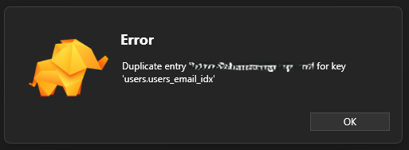
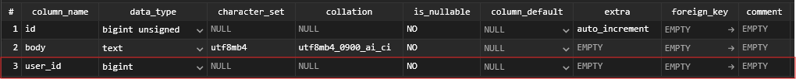
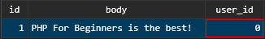
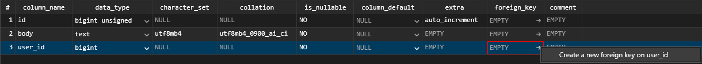
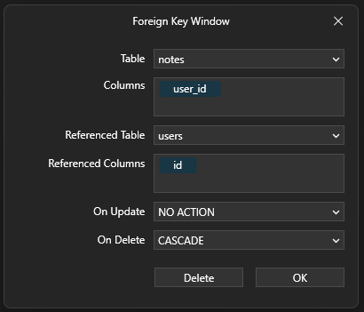

# Database Tables and Indexes

When designing a database schema it's important to consider things suchas 'can a user email be associated with more than one account?' 

Unique indexes can be used to control this kind of behaviour.

## Add a Unique Index

In TablePlus an index can be added to a field by clicking `Index` at the bottom of the window.

This will open the Index window where the `is_unique` attrribute can be set to `TRUE` or `FALSE` and the `column_name` can be set for the column the index attribute should be applied to.

Now if a user tries to create an account with an email that already exists within the database, the database will throw an error like this:

## Creating Relationships

Data relationships help to preserve database integrity. One example of relationships in databases is foreign keys.

### In the notes table add a column for `user_id`:

Now in the notes table there will be an additional record for `user_id`

***Note:*** *By default this record is set to 0. This is a good example of how data consistency can be compromised as there is no user with an id of 0. Preventing this is discussed later; For now just set it to one.*

### Add the foreign key:
In the notes table structure:

***Note:*** *Make sure the data_type between id and user_id is an exact match and not like the image otherwise the FK constraint won't work*

Now, when the user is deleted, any posts that are linked to their user id will also be deleted.