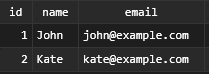
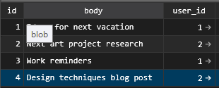

# Render the Notes Page
Now that the initial database structure in place, let's create one page to display all of John Doe's notes, and then another page for each individual note.

## Prepare some dummy data in the database

### Users table



### Notes table


*Don't forget to set the fk on user_id*

## Add a Link to the Navigation Menu
Back in the `nav.php` partial, add a link for Notes

## Add that link to the router
In router.php add the uri for the notes page to point to the controller

## Create a Notes controller
Create the notes controller to require the Notes view. The logic for the database class instance also needs to be moved to the controller. Once that is in the controller, any queries here can be passed to the view to be displayed. If this was being built in a framework like Laravel this would likely be done in a service container so that the database would be accessible across the entire app.

**Controller**
```php
$config = require("config.php");
$db = new Database($config['database'], $config['database']['user'], $config['database']['password']);

$notes = $db->query("SELECT * FROM notes WHERE user_id = 1")->fetchAll();
```

**View**
```php
  <?php foreach($notes as $note) : ?>
    <li><?= $note['body']; ?></li>
  <?php endforeach ?>
```

***Note:** The order that things are required in index.php is important. The database needs to be imported before the router otherwise the router will access the controller before the controller can access the database, resulting in nothing showing from the database.* 

Each `<li>` could then contain a link which would link to the full note. To do this the link would need to be dynamically generated. Realistically this would be done by generating a unique slug for each note but that is a little beyond the scope of the basic router in this project so instead the `$note['id']` can be used by echoing it out as the href attribute.

```php
  <?php foreach($notes as $note) : ?>
    <li>
      <a href="/note?=<?= $note['id'] ?>">
        <?= $note['body']; ?>
      </a>
    </li>
  <?php endforeach ?>
```

Then repeat the cycle for adding a new page:

- Create a route
- Create a controller
- Create a view

**Router**
Add the endpoint to the router:
```php
"/note" => "controllers/note.php",
```

**Controller**
Add the controller logic
```php
<?php

$config = require("config.php");
$db = new Database($config['database'], $config['database']['user'], $config['database']['password']);

$note = $db->query("SELECT * FROM notes WHERE id = ?", [$_GET['id']])->fetch(); // Use fetch as we only want a single result

$heading = $note['body'];

require "views/note.view.php";
```
*This is why a service container would be better. Without one, an instance of the Database class needs to be created each time access to the database is required.*

**View**
```html
<main>
  <div class="mx-auto max-w-7xl my-6 px-4 py-1 sm:px-6 lg:px-8">
    <p><?= $note['body']; ?></p>
  </div>

  <div class="mx-auto max-w-7xl my-6 px-4 py-1 sm:px-6 lg:px-8">
    <a href="/notes" class="text-blue-500 underline">Back to all notes...</a>
  </div>
</main>
```

As `fetch()` was used to get the value of `$note` in the controller the `$note` array and it's offsets can be accessed directly rather than having to loop through to unpack them.